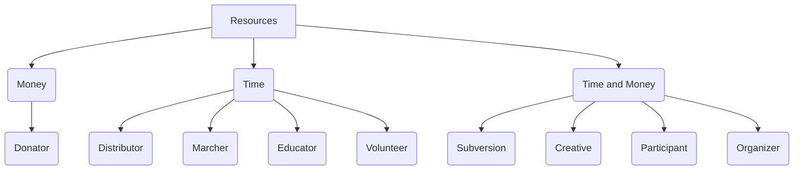

# The Advancement (Non-Technical)

In addition to being a repo for products and apps to be built, The Advancement is a movement for everyone (except fascists).
The most common response from people I interact with regarding it is that they'd love to help, but don't know how.
This doc is about how to use _your_ skills to take on the scourge of Advertising. 

## Where to start

First and foremost, acknowledging that something is wrong, and wanting it to be better is in and of itself a form of resistance and action. 
There are a myriad of quotes regarding how indifference and ignorance are worse than inaction, and those aren't said for nothing.
But more importantly, when it comes to fighting something as ubiquitous as advertising, it's got to be an all hands on deck situation.

There's room for everyone in the revolution.

## Ok now what

There are many ways to contribute to any cause, some of which involve more resources than others. 
If we were to layout a flowchart of how to engage, it might look something like this:

(this is adapted from this [excellent Reddit post](https://www.reddit.com/r/WitchesVsPatriarchy/comments/1ial9gy/there_is_a_role_for_everyone/?share_id=Ef92AOSSVhWQOQ1A6m8cy&utm_content=1&utm_medium=ios_app&utm_name=ioscss&utm_source=share&utm_term=1))

* Donator - So long as we live in a society with money, money will be useful. 
Even something as small as paying for the gas to have someone pick up groceries for a group can go a long way.

* Distributor - There are soooo many ways to disseminate information these days, and it'll be a rare person who has a presence in all of them.
Just getting the word out is an essential part of the process.

* Marcher - The world will always need those willing to put their bodies on the line, and visibly stand up for the cause.

* Educator - Like the distributor, people learn about things in so many different ways that the more people involved in educating, the more people we can reach.

* Volunteer - Just like the marcher, people willing to give their labor to the cause are always needed.

* (Quiet) Subversion - Those willing to go against the establishment and provide resources and shelter for those in need always play a crucial part. Part of the job of those of us in other roles are to protect these brave people in their work.

* Creative - Propoganda cuts both ways. And it tends to be more powerful when it's not rooted in lies.

* (Community) Participant - It's easy to lose sight of the fact that there are still local communities around. 
In the face of global gigantocorps, sometimes the best resistance is a potluck.

* (Community) Organizer - Getting people together to do anything is a challenge. If you have that skill, I encourage you to use it.

If one or more of these options appeals to you then welcome. 

## I know what I want to do, but I can't find the time/money/motivation

Anger is a powerful motivator.
It's also something that thankfully subsides even with constant stressors. 
Time, and money are finite resources. 
It can be very hard to commit these three things against daunting threats.

I think everyone solves for this commitment in different ways, so I'll simply offer mine.

I have a two year old.
I think there's a non-zero chance right now that the Earth will be gone before he has a chance to grow up. 
And I simply can't sit idle with that chance. 

You don't have to join this effort, but for whatever two year old there may be in your life, don't give up.

As for time, take out your phone.
If you have an iPhone go to Settings > Screen Time, and if you have an Android check out Settings > Digital Wellbeing.
Take a look at the apps in your top usage, and see if there are any you could use a little less in the cause against advertising.

As for money, well that's harder to just come by, but Planet Nine is working on that, and in the meantime, for the like three people not drowning in debt from health care, education, or needing to repair an engine because your one mode of transportation is your car, be on the look out for places to help.

## I'm in, how do I get involved

First things first, we need a place to chat. 
For now that'll be discord: https://discord.gg/uMexY73Z (this link will expire in 7 days. email zach@planetnine.app if he's been derelict in updating it)
This is where we'll organize efforts, but you need not be there to do so, resistance doesn't need to be coordinated.

Soon there will be apps to replace social media apps that people use.
Using those will help them gain traction, and ensure we can make them an experience that people will actually use.

And installing the browser extension for The Advancement will get you started.

