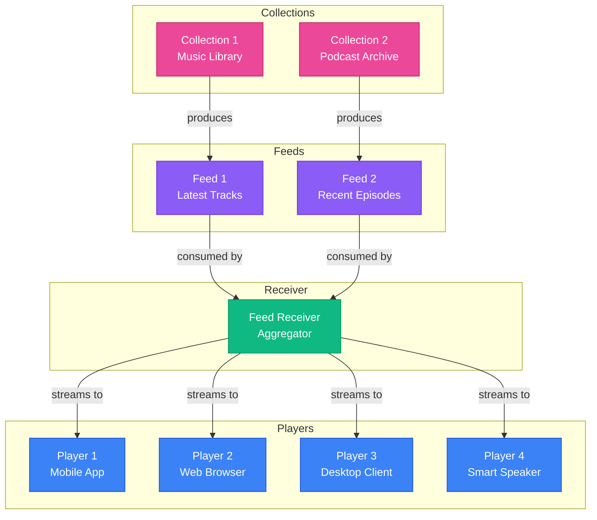

# Feed Architecture Diagram

## Architecture Description

**Collections** (Pink):
- Collection 1: Music Library - Source of music tracks
- Collection 2: Podcast Archive - Source of podcast episodes

**Feeds** (Purple):
- Feed 1: Latest Tracks - RSS/streaming feed from music collection
- Feed 2: Recent Episodes - RSS/streaming feed from podcast collection

**Receiver** (Green):
- Single aggregation point that consumes both feeds
- Normalizes and merges content from multiple sources
- Manages playback queue and state

**Players** (Blue):
- Player 1: Mobile App - iOS/Android application
- Player 2: Web Browser - Browser-based player
- Player 3: Desktop Client - Native desktop application
- Player 4: Smart Speaker - Voice-controlled device

All players connect to the same receiver for synchronized content delivery.
